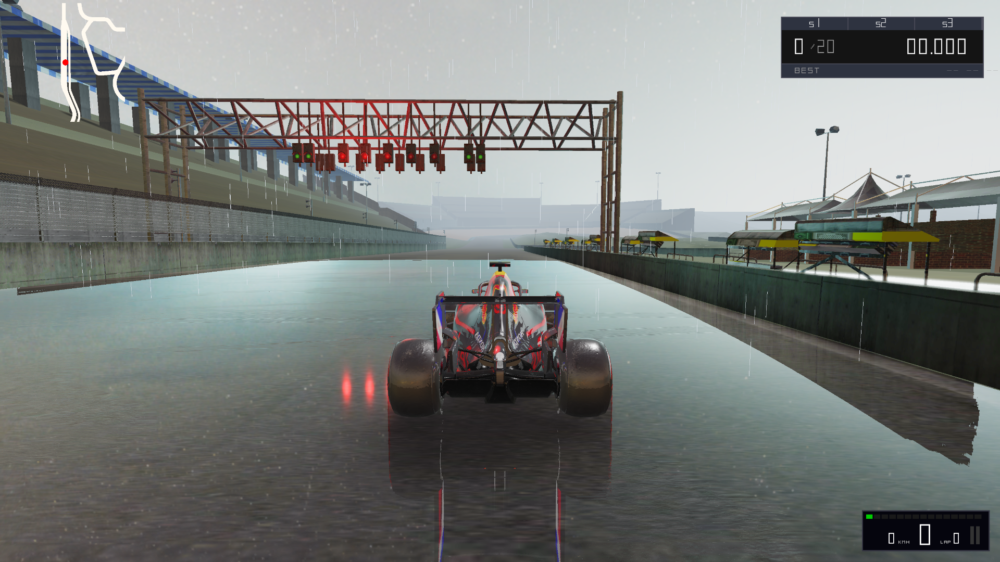
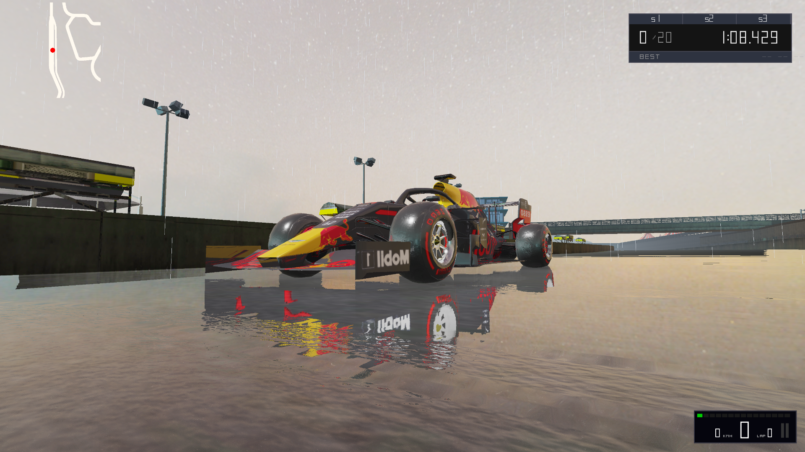
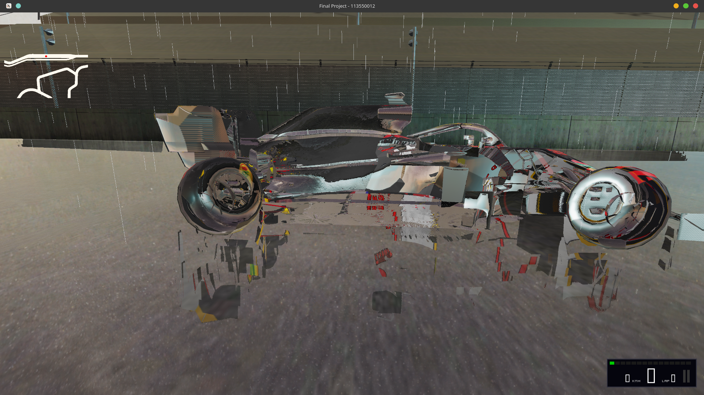

# 🏎️ Apex Engine: An OpenGL-based F1 Racing Graphics Engine & Immersive Track Implementation

## group42 113550012 游閔皓 113550175 黃柏瑜

> **A custom-built, high-fidelity 3D game engine featuring Deferred Shading, PBR, and Physics-based vehicle dynamics.**

## 📖 Project Overview

**Apex Engine** is a high-performance racing simulation framework developed from scratch using **C++** and **OpenGL (Core Profile)**. Unlike projects built on top of commercial engines like Unity or Unreal, Apex handles all low-level graphics pipeline management, memory allocation, and physics calculations manually.

The engine features a modern **Deferred Rendering Pipeline**, physically based materials (PBR), dynamic lighting, and a robust glTF asset loading system capable of handling complex node hierarchies and animations.

## 🚀 Key Features

### 1. Advanced Graphics & Rendering

* **Deferred Shading Architecture**:
    * Separates geometry processing from lighting calculations using a **G-Buffer** (Position, Normal, Albedo+Spec, Roughness+Metallic).
    * 
    * Allows for efficient rendering of multiple dynamic light sources without performance degradation.
* **Physically Based Rendering (PBR)**:
    * Implemented **Metallic-Roughness Workflow**.
    * Accurate light interaction with materials (e.g., asphalt matte finish vs. car paint reflection).
    * **Image-Based Lighting (IBL)** ready architecture.
* **Shadow Mapping**:
    * Directional light shadows with **Orthographic Projection**.
    * Optimized for large-scale track rendering.
* **Post-Processing Pipeline**:
    * **HDR (High Dynamic Range)**: Floating point framebuffers allowing light values > 1.0.
    * **Bloom**: High-pass filtering combined with dual-pass Gaussian Blur for realistic glowing lights.
    * **Tone Mapping**: Reinhard / Exposure-based tone mapping to convert HDR to LDR (sRGB).
    * **Anisotropic Filtering**: Enabled 16x anisotropic filtering to fix blurry road textures at oblique angles.

### 2. Vehicle Physics & Simulation

* **Terrain Adaptation**:
    * Implemented **Barycentric Coordinates** interpolation to calculate precise ground height on a non-flat track.
    * Optimized collision detection using a **Uniform Grid Spatial Partitioning** algorithm (reducing complexity from O(N) to O(1) for height checks).
* **Dynamic Wheel Animation**:
    * Wheels are treated as separate scene nodes with independent transformation matrices.
    * **RPM-based Rotation**: Rotational speed calculated based on linear velocity (v = r * omega).
    * **Steering Ackermann Geometry**: Front wheels rotate visually based on input steering angle.
    * 
* **Driving Mechanics**:
    * Non-linear throttle and braking response curves.
    * Inertia and friction simulation.

### 3. Game Logic & Systems

* **Race Management System (FSM)**:
    * Finite State Machine handling: `PRE_START` -> `COUNTDOWN` -> `READY` -> `RACING`.
    * **F1 Style Start Sequence**: 5 Red Lights logic with randomized "Lights Out" delay.
    * **Jump Start Detection**: Penalty system for moving before the signal.
* **Lap Timing**:
    * Checkpoint system to prevent cheating.
    * Lap counter and finish line detection logic.
* **Camera Systems**:
    * **TPS (Third Person)**: Smooth follow with lag/lerp.
    * **FPP (First Person)**: Cockpit view attached to car frame.
    * **Free Cam**: Debug camera for scene inspection.

### 4. Visual Effects (VFX)

* **Dynamic Weather**:
    * Rain effect generated via **Geometry Shaders**.
    * "Wetness" shader logic: Modifies roughness and albedo of the asphalt dynamically when raining.
* **UI / HUD**:
    * Vector-based rendering for F1 dashboard (Speed, Gear, RPM bar, Pedals).
    * Real-time Mini-map rendering using a separate framebuffer pass.

## 🛠️ Tech Stack & Architecture

| Category | Technology | Usage |
| :--- | :--- | :--- |
| **Language** | C++17 | Core logic |
| **Graphics API** | OpenGL 3.3+ | Rendering pipeline |
| **Windowing** | GLFW | Window creation, Input handling |
| **Loader** | GLAD | OpenGL function pointer loading |
| **Math** | GLM | Matrix, Vector, Quaternion math |
| **Asset Loader** | **tinygltf** | Loading `.glb` files (JSON + Binary) |
| **Asset Loader** | stb_image | Loading texture images |

How to conpile : 

    cmake -S . -B build
    cmake --build build
    .\bin\RacingGame.exe

### Rendering Pipeline Flow
1.  **Shadow Pass**: Render scene depth from light's perspective.
2.  **Geometry Pass**: Render scene into G-Buffer (Albedo, Normal, Position, PBR Params).
3.  **Lighting Pass (Deferred)**: Calculate lighting using G-Buffer data -> Write to HDR Buffer.
4.  **Forward Pass**: Render transparent objects (Rain, Glass) and Skybox -> Blend into HDR Buffer.
5.  **Post-Process Pass**:
    * Extract Bright Areas -> Blur (Bloom).
    * Combine Scene + Bloom.
    * Tone Mapping (HDR -> LDR).
    * Render to Screen Quad.
6.  **UI Pass**: Render HUD and Mini-map on top.

## ⚔️ Technical Challenges & Solutions

During the development of **Apex Engine**, spanning from legacy `.obj` loading to modern PBR rendering, several critical low-level issues were encountered and solved.

### 1. Texture Coordinate System Conflict

* **The Problem**: Textures were loaded but appeared shattered, flipped, or misplaced on the car body (e.g., logos on the wrong side).
* **Root Cause**: OpenGL defines `(0,0)` at the **Bottom-Left**, while the glTF standard defines `(0,0)` at the **Top-Left**.
* **The Solution**: Implemented automatic V-axis flipping during the mesh loading phase: `uv.y = 1.0f - uv.y`.

### 2. Node Hierarchy & Matrix Baking

* **The Problem**: Wheels were statically fused to the car body. Rotating the wheel matrix rotated the entire car or did nothing.
* **Root Cause**: The initial loader "baked" global transforms into vertices for simplicity. This destroyed the local coordinate systems required for independent animation.
* **The Solution**: Refactored the loader to detect "Wheel" nodes by name. For these dynamic parts, the loader preserves the `localTransform` in the `SubDraw` struct instead of baking it. The transformation is then dynamically calculated in the game loop (`ModelMatrix * LocalOffset * Rotation`).

### 3. Texture Edge Artifacts

* **The Problem**: Black lines and noise appeared at UV seams on the car body.
* **Root Cause**: Texture wrapping was set to `GL_REPEAT`. UVs at the exact edge (0.0 or 1.0) were interpolating with pixels from the opposite side of the texture.
* **The Solution**: Enforced `GL_CLAMP_TO_EDGE` for all model textures, ensuring valid edge sampling.

### 4. Back-Face Culling Inversion

* **The Problem**: The car appeared transparent/inside-out after loading.
* **Root Cause**: The model's winding order (Clockwise) conflicted with OpenGL's default (Counter-Clockwise), causing the front faces to be culled.
* **The Solution**: Selectively disabled culling (`glDisable(GL_CULL_FACE)`) during the car rendering pass to ensure double-sided rendering.

### 5. Real-time Mini-Map Coordinate Mapping

* **The Problem**: Implementing a dynamic mini-map that accurately tracks the player's position on a non-linear, twisting track.
* **Root Cause**: The 3D world coordinates (World Space) needed to be mapped to a 2D UI texture (Screen Space), but simply scaling the coordinates wasn't enough due to the track's irregular shape and boundaries.
* **The Solution**: Implemented a **coordinate normalization system**. I calculated the bounding box of the entire track geometry (`min` to `max`) and mapped the car's world position to a normalized UV range `[0, 1]`. This was then rendered in a separate UI pass using an Orthographic projection to overlay correctly on the HUD.

### 6. Physically Accurate Puddles & Wet Road Simulation

* **The Problem**: The road surface looked uniformly "plastic" and dry, failing to represent the rainy weather condition realistically.
* **Root Cause**: Standard rendering applies a single roughness value to the whole object. Real wet asphalt varies spatially—puddles are mirror-like, while dry spots are matte.
* **The Solution**: Integrated a **custom-painted Roughness Map**.
    * **Visuals**: Modified the PBR Fragment Shader to read this map. Darker areas on the map force the material's roughness to near-zero (water) and darken the Albedo color (simulating light absorption).
    * **Logic**: The shader logically mixes the dry asphalt properties with water properties based on the pixel's texture value, creating realistic, spatially varying reflections.

## 🎮 Controls

### keyboard

* **W / S**: Accelerate / Brake (Reverse)
* **A / D**: Steering Left / Right
* **V**: Switch Camera View (TPS / FPP)
* **R**: Toggle Rain Effect
* **F1**: Toggle Mouse Cursor

* **L**: Toggle Free Camera Mode (debug)
* **P**: output camera coordinate (debug)

### Controller

* **R2**: acceleration
* **L2**: decceleration
* **LS**: control direction

---

## 🔮 Future Roadmap

* **Shadow Quality**: Implement **PCF (Percentage-Closer Filtering)** for soft shadows.
* **Audio**: Integrate **OpenAL** for engine and environmental sounds.
* **Collision**: Implement OBB (Oriented Bounding Box) collision for car-to-wall physics.
* **AI**: Add pathfinding-based AI opponents.

---
